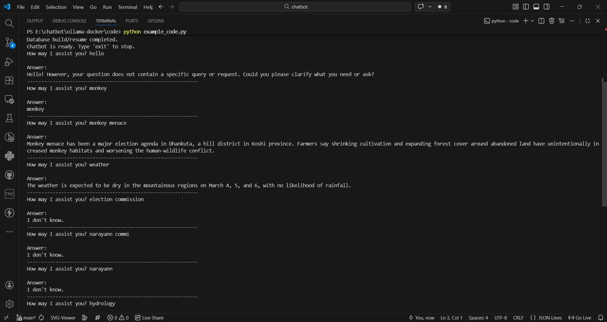

# 🧠 Chatbot RAG System using Ollama + ChromaDB

A simple Retrieval-Augmented Generation (RAG) chatbot built using:

- 🦙 Ollama (Local LLM & Embeddings)
- 🗂 ChromaDB (Vector Database)
- 🔎 LangChain Text Splitter
- 🐍 Python
- 🐳 Docker (Optional)


---


---

## 📸 Demo Preview

<p align="center">
  
</p>

<p align="center">
  <em>Figure: Terminal output showing Retrieval-Augmented Generation (RAG) response using Ollama + ChromaDB</em>
</p>

---

---

---

## 📁 Project Structure

```
chatbot/
│
├── docker-compose.yml
├── requirements.txt
├── README.md
│
└── ollama-docker/
    └── code/
        ├── articles.jsonl
        ├── chunking.py
        ├── chunking_langchain_ollama.py
        ├── rag_concept.py
        ├── vector_db.py
        ├── counter.py
        ├── counter.txt
        ├── example_code.py
        ├── simple.txt
        ├── chroma/
        └── __pycache__/
```

---

## 🚀 Features

- 📚 Reads data from `articles.jsonl`
- ✂ Splits text into chunks
- 🔢 Generates embeddings using `nomic-embed-text`
- 💾 Stores vectors in ChromaDB
- 🤖 Uses `qwen3:4b-instruct` for answering questions
- 📊 Tracks skipped sentences using counter system
- 🔍 Retrieves top-k similar chunks

---

## 🛠 Requirements

- Python 3.11+
- Ollama installed locally
- Docker (optional)

---

## 📦 Install Dependencies

```bash
pip install -r requirements.txt
```

---

## 🦙 Install Required Ollama Models

```bash
ollama pull nomic-embed-text
ollama pull qwen3:4b-instruct
```

---

## ▶️ Run the Project

Go to the code directory:

```bash
cd ollama-docker/code
```

Run the script:

```bash
python example_code.py
```

---

## ⚙️ How It Works

1. Load articles from JSONL file  
2. Split text into chunks  
3. Generate embeddings  
4. Store embeddings in ChromaDB  
5. Retrieve top relevant chunks  
6. Send context + question to LLM  
7. Generate final answer  

---

## 🧮 Counter System

The `counter.py` tracks:
- Number of skipped sentences  
- Number of processed lines  
- Maintains state in `counter.txt`  

---

## 📊 Example Output

```
Answer:
The House of Representatives elections will take place on March 5.
```

---

## 🐳 Docker Setup (Optional)

```bash
docker-compose up --build
```

---

## 🧠 Models Used

- Embedding Model: `nomic-embed-text`
- Chat Model: `qwen3:4b-instruct`

---

## 📌 Future Improvements

- Add Web UI (Streamlit / FastAPI)
- Improve Retrieval Quality
- Add Memory System
- Deploy on VPS
- Connect to Frontend

---

## 👨‍💻 Author

Janak Rokaya 
Chatbot RAG Project  
Kathmandu Engineering College